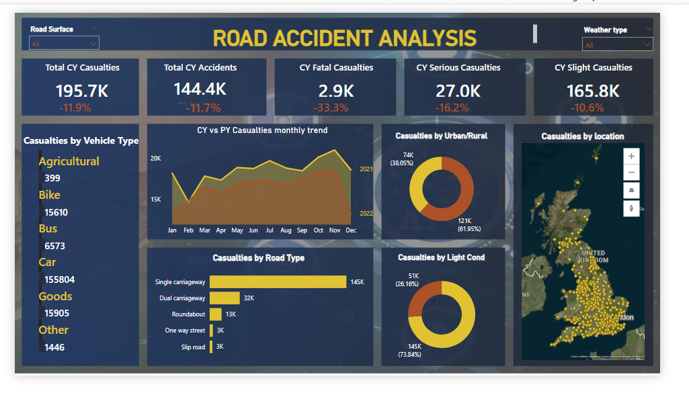

# 🚦 UK Road Accident Analysis Dashboard 

##  Project Overview

This project analyzes UK road accident data for 2021 and 2022 to identify trends in accident frequency, casualty severity, vehicle involvement, and geographic risk distribution.

The objective was to design an interactive Power BI dashboard that enables stakeholders to monitor accident trends, track Year-over-Year (YoY) performance, and support data-driven road safety decisions.

---
## 📷 Dashboard Preview

---
##  Business Problem

The Ministry of Transport requires insights into:

- Total accidents and casualties trends  
- Severity distribution (Fatal, Serious, Slight)  
- Urban vs Rural accident concentration  
- High-risk road types and vehicle categories  
- Geographic hotspots  
- Year-over-Year performance comparison  

The goal is to improve road safety planning and resource allocation.

---

## Key Stakeholders

- Ministry of Transport  
- Road Transport Department  
- Police Force  
- Emergency Services  
- Traffic Management Authorities  
- Road Safety Organizations  

Each stakeholder requires different analytical insights for policy-making, enforcement planning, and emergency response optimization.

---

##  Tools & Technologies

- **Power BI** – Dashboard development  
- **Power Query** – Data cleaning & transformation  
- **DAX (Data Analysis Expressions)** – KPI calculations & time intelligence  
- **Microsoft Excel** – Data source  

---

##  Data Preparation (Power Query)

The raw dataset was cleaned and transformed before analysis:

- Removed null and duplicate records  
- Standardized date formats  
- Created Year and Month columns for time-based analysis  
- Derived Day/Night classification column  
- Cleaned and grouped vehicle type categories  
- Ensured correct data types for modeling  

These transformation steps ensured accurate KPI calculation and reliable reporting.

---

##  Data Modeling

- Structured dataset to support time-based analysis  
- Created calculated columns for trend comparison  
- Built measures for Current Year (CY) vs Previous Year (PY) analysis  
- Optimized data model for performance and efficient reporting  

---

##  DAX Measures Implemented

The following key measures were created:

- Total Casualties  
- Total Accidents  
- CY Casualties  
- PY Casualties  
- YoY Growth %  
- Fatal Casualties  
- Serious Casualties  
- Slight Casualties  
- Monthly Trend Comparison  

Time intelligence functions were used to calculate accurate Year-over-Year comparisons.

---

##  Dashboard Features

### 🔹 Primary KPIs
- Total CY Casualties: **195.7K** (-11.9% YoY)  
- Total CY Accidents: **144.4K** (-11.7% YoY)  
- Fatal Casualties: **2.9K** (-33.3% YoY)  
- Serious Casualties: **27.0K**  
- Slight Casualties: **165.8K**

### 🔹 Analytical Insights
- Monthly trend comparison (CY vs PY)  
- Casualties by vehicle type  
- Casualties by road type  
- Urban vs Rural distribution  
- Day vs Night accident comparison  
- Geographic hotspot analysis (Map visualization)  
- Interactive filters (Road Surface, Weather Type)

---

##  Key Insights

- Total casualties decreased by **11.9%** Year-over-Year.  
- Fatal casualties reduced significantly by **33.3%**.  
- Urban areas account for approximately **62%** of total casualties.  
- Single carriageways contribute the highest number of accidents.  
- Around **73%** of accidents occur during daylight.  
- Cars are involved in the majority of casualties.

---

##  Business Recommendations

- Increase monitoring and enforcement in urban accident-prone areas.  
- Implement additional safety measures on single carriageways.  
- Launch targeted awareness campaigns for car drivers.  
- Improve visibility and traffic management in high-density regions.  

---

##  Project Outcome

This dashboard provides a comprehensive analytical view of UK road accident data, enabling stakeholders to track performance trends, identify risk factors, and support data-driven safety strategies.

---

##  Contact

If you would like to discuss this project or collaborate, feel free to connect with me on LinkedIn.

